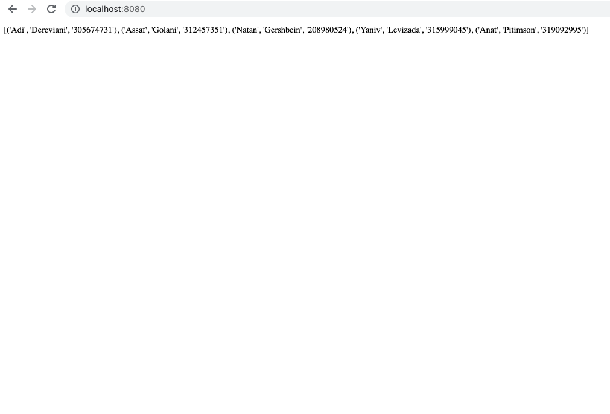

# docker-compose-stack
Docker compose stack with Python app and Postgres DB

## Information
This simple projects runs PostgreSQL database, with the project's team members information.  
The app is Python based, using psycopg2 for PostgreSQL connection and Flask framework for creating web application.  

# Object Oriented Painter Project

